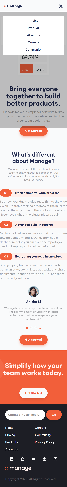
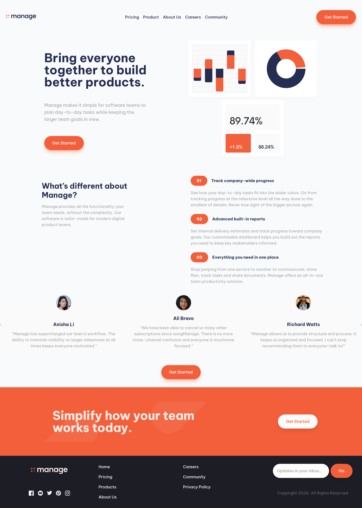

# Manage Landing Page

A responsive landing page for **Manage**, a fictional project-management product, built with React and Tailwind CSS as a [Frontend Mentor](https://www.frontendmentor.io/) challenge.

**Live demo:**


**Screenshot:**



## Tech Stack

- [React 19](https://react.dev/) with Vite
- [Tailwind CSS v4](https://tailwindcss.com/), with brand colors and font defined as design tokens in `@theme`
- ESLint + Prettier (`prettier-plugin-tailwindcss`)

## Features

- **Responsive layout** across mobile, tablet and desktop breakpoints
- **Mobile navigation** with a hamburger/close toggle and a dimmed overlay
- **Reviews carousel** built from scratch, without a slider library (see below)
- **Newsletter form** with regex email validation and inline error feedback
- **Data-driven UI**: nav items, features, reviews and footer content live in one `data.jsx` file and are rendered through a shared `Article` component with variants (hero, feature, review, default)

## The Challenge: Reviews Carousel

The reviews section behaves differently per screen size, and I built it with native browser scrolling instead of a library:

- **Layout:** a horizontal track using CSS scroll snap (`snap-x snap-mandatory`), with each card's width changing per breakpoint (1, 2, or 3 cards visible).
- **Navigation:** dot indicators on small screens and prev/next arrows on large screens, both calling one `scrollToIndex` function that uses a `ref` and `scrollTo({ behavior: 'smooth' })`.
- **Keeping state in sync:** a scroll listener (added and cleaned up in `useEffect`) computes the current card from `scrollLeft`, so the active dot stays correct whether the user clicks, swipes or scrolls.

## Getting Started

```bash
git clone https://github.com/Origin-B/manage-landing-page.git
cd manage-landing-page
npm install
npm run dev
```

| Command           | Description                  |
| ----------------- | ---------------------------- |
| `npm run dev`     | Start the development server |
| `npm run build`   | Build for production         |
| `npm run preview` | Preview the production build |
| `npm run lint`    | Lint the codebase            |

## Project Structure

```
src/
├── Components/
│   ├── Header/   # Header, NavbarList
│   ├── Main/     # MainHeader, Features, Reviews, MainFooter, Article
│   ├── Footer/   # Footer, FooterList, newsletter form
│   └── Shared/   # Btn, data, itemsRender
├── App.jsx
└── index.css     # Tailwind import and design tokens
```

## Author

**Origin-B** - [GitHub](https://github.com/Origin-B)
